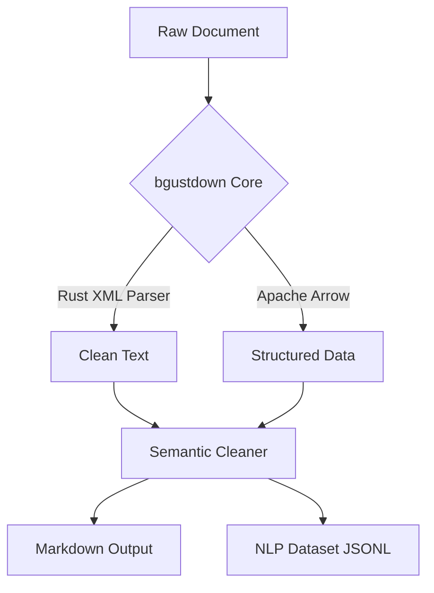

# 🚀 bgustdown

<p align="center">
  <b>The definitive high-performance document engine for the AI era.</b><br>
  <i>Convert PDF, DOCX, and XLSX to clean Markdown & NLP datasets in milliseconds.</i>
</p>

<p align="center">
  
  
  
</p>

---

## 💡 The Vision

**bgustdown** is not just another document converter. It is a data engineering powerhouse built from the ground up in **Rust** to eliminate the performance bottlenecks in AI data pipelines. Whether you are building a RAG system or fine-tuning models like BERT/BETO, bgustdown provides the speed, semantic integrity, and structural precision required for production-grade AI applications.

## ✨ Key Features

- **⚡ Blazing Fast:** Powered by Rust and Tokio for real parallel processing. Process massive spreadsheets or complex PDFs in ~15ms.
- **📊 Industrial Data Handling:** Native **Apache Arrow** integration for tabular data (XLSX, CSV), ensuring memory efficiency and scalability.
- **🧠 Semantic Intelligence:** Built-in semantic cleaning to remove headers, footers, and noise. Optimized for **BERT/BETO** fine-tuning with context-aware sentence segmentation.
- **📦 Zero-Dependency Runtime:** Pre-compiled native binaries via **NAPI-RS**. No Python, no complex system dependencies. Just `npm install`.

## 🛠 Supported Formats

| Category | Formats | Engine |
| :--- | :--- | :--- |
| **Documents** | `.docx`, `.odt` | Native Rust XML Parser |
| **Data** | `.xlsx`, `.xls`, `.csv`, `.ods` | Calamine + Apache Arrow |
| **Rigid** | `.pdf` | pdf-extract |
| **AI Output** | `.md`, `.jsonl` | Semantic Dataset Builder |

## 🚀 Quick Start

### Installation

```bash
npm install bgustdown
```

### Basic Usage (Markdown Conversion)

```javascript
const { Bgustdown } = require('bgustdown');

async function run() {
  const client = new Bgustdown();
  const markdown = await client.convert('./report.pdf');
  console.log(markdown);
}

run();
```

### Professional NLP Prep (Sentence Segmentation)

```javascript
const { Bgustdown } = require('bgustdown');

async function prepare() {
  const client = new Bgustdown();
  const markdown = await client.convert('./legal_code.docx');
  
  // Clean noise and segment for BERT training
  const sentences = client.prepareTrainingData(markdown, 'legal', 'public_records');
  console.log(`Generated ${sentences.length} high-quality training pairs.`);
}

prepare();
```

## 🏗 Architecture



## 📜 Attribution & Ethics

This project is inspired by the conceptual design of Microsoft's **MarkItDown**. We have ported the philosophy to Rust to achieve a new level of performance and specific specialization for NLP dataset preparation.

- **Original Project:** [MarkItDown](https://github.com/microsoft/markitdown) by Microsoft Corporation.
- **License:** MIT

## 🤝 Contributing

Contributions are welcome! If you want to improve a parser or add a new format, feel free to open a PR.

---

<p align="center">
  Built with ❤️ for the open-source community by <b>B-GUST</b>.
</p>
