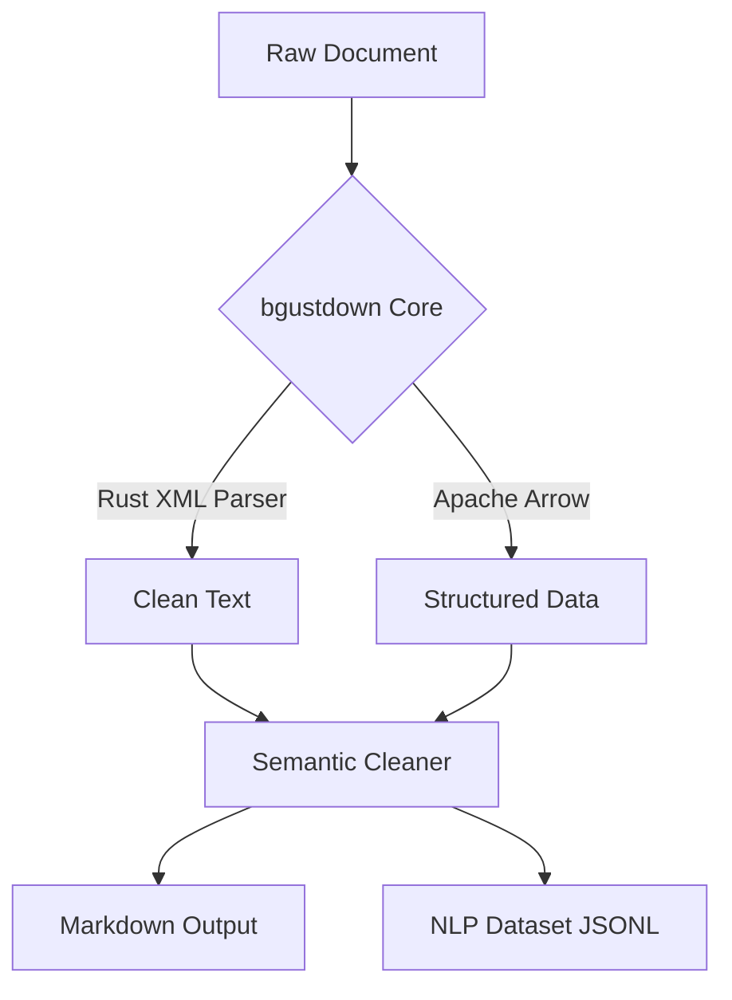

# 🚀 bgustdown

<p align="center">
  <b>The definitive high-performance document engine for the AI era.</b><br>
  <i>Convert PDF, DOCX, and XLSX to clean Markdown & NLP datasets in milliseconds.</i>
</p>

<p align="center">
  <a href="https://www.npmjs.com/package/bgustdown"></a>
  
  
  <a href="https://bgustdown.lat"></a>
</p>

---

## 💡 The Vision

**bgustdown** is a high-performance data engineering tool built in **Rust**. It is designed with a dual purpose:
1. **As a fast converter:** A reliable layer to transform messy documents into clean text before feeding them into an LLM.
2. **As a semantic engine:** A specialized tool to create training-ready datasets with structural integrity and context-aware segmentation.

*Note: While using it only for conversion is highly effective, its true potential lies in its ability to prepare high-quality data for NLP fine-tuning.*

## 🧠 AI Skill Integration

**bgustdown** is an **AI-native skill**. It can be installed as a local tool for AI agents (Gemini, Claude, GPT) to interact with local documents.

### How to Install as a Skill
1. **Via NPM (Global):**
   ```bash
   npm install -g bgustdown
   ```
2. **Manual (Agent Directory):**
   Clone this repository into your agent's skill folder (e.g., `.agents/skills/bgustdown`).

### How to use as a Skill
Agents can execute the following commands via terminal:

```bash
# To convert a document to Markdown
npx bgustdown convert ./my-document.pdf

# To prepare a dataset for NLP (Clean segmentation & JSON output)
npx bgustdown prepare ./legal-text.docx
```

## 🛠 Command Reference (CLI)

| Command | Action | Output |
| :--- | :--- | :--- |
| `convert <path>` | Extracts text & tables from file. | Clean Markdown String |
| `prepare <path>` | Segments text into training sentences. | JSON Array of sentences |

## ✨ Key Features

- **⚡ Blazing Fast:** Powered by **Rust** and Tokio for real parallel processing.
- **📊 Apache Arrow:** Industrial-grade tabular data handling for XLSX and CSV.
- **🧠 Semantic Intelligence:** Built-in cleaning of noise (headers, footers, page numbers).
- **📦 Zero-Dependency Runtime:** Pre-compiled native binaries via **NAPI-RS**.

## 🚀 Quick Start

### Installation
```bash
npm install bgustdown
```

### Library Usage
```javascript
const { Bgustdown } = require('bgustdown');
const client = new Bgustdown();

// Convert any supported file
const md = await client.convert('file.docx');
```

## 🏗 Architecture



## 📜 Attribution & Technical Stack

- **Conceptual Inspiration:** Based on the design of Microsoft's **MarkItDown**.
- **Engine:** Built from scratch in **Rust** for extreme performance.
- **Packaging:** Uses **NAPI-RS** to provide native bindings for the Node.js ecosystem.
- **License:** MIT

---
<p align="center">
  Built for the open-source community by <b>B-GUST</b>. Visit <a href="https://bgustdown.lat">bgustdown.lat</a> for more.
</p>
