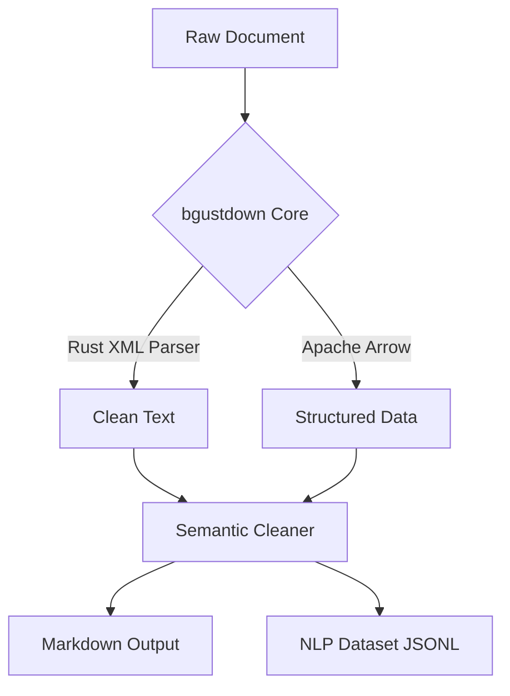

# 🚀 bgustdown

<p align="center">
  <b>The definitive high-performance document engine for the AI era.</b><br>
  <i>Convert PDF, DOCX, and XLSX to clean Markdown & NLP datasets in milliseconds.</i>
</p>

<p align="center">
  <a href="https://www.npmjs.com/package/bgustdown"></a>
  
  
  <a href="https://bgustdown.lat"></a>
</p>

---

## 💡 The Vision

**bgustdown** is a high-performance data engineering tool built in **Rust**. It eliminates the performance bottlenecks in AI data pipelines by providing ultra-fast document conversion, semantic cleaning, and structural precision.

## 🧠 AI Skill Integration

**bgustdown** is designed to be used by AI Agents (Gemini, Claude, GPT) as a native tool to interact with local files.

### How to use as a Skill
If you are using an AI agent, you can simply point it to this repository or install the package via NPM. The agent can then execute:

```bash
# To convert a document to Markdown
npx bgustdown convert ./my-document.pdf

# To prepare a dataset for NLP fine-tuning (JSON output)
npx bgustdown prepare ./legal-text.docx
```

## 🛠 Command Reference (CLI)

| Command | Action | Output |
| :--- | :--- | :--- |
| `convert <path>` | Extracts text & tables from file. | Clean Markdown String |
| `prepare <path>` | Segments text into training sentences. | JSON Array of sentences |

## ✨ Key Features

- **⚡ Blazing Fast:** Parallel processing without Python's GIL.
- **📊 Apache Arrow:** Industrial-grade tabular data handling.
- **🧠 Semantic Cleaning:** Automatic removal of page numbers, headers, and footers.
- **📦 Zero-Dependency:** Pre-compiled binaries. No Python required.

## 🚀 Quick Start

### Installation
```bash
npm install bgustdown
```

### Library Usage
```javascript
const { Bgustdown } = require('bgustdown');
const client = new Bgustdown();

// Convert any supported file
const md = await client.convert('file.docx');
```

## 🏗 Architecture



## 📜 Attribution & Ethics

This project is inspired by the conceptual design of Microsoft's **MarkItDown**. Ported to Rust for extreme performance.

- **Original Project:** [MarkItDown](https://github.com/microsoft/markitdown) by Microsoft.
- **License:** MIT

---
<p align="center">
  Built for the open-source community by <b>B-GUST</b>. Visit <a href="https://bgustdown.lat">bgustdown.lat</a> for more.
</p>
