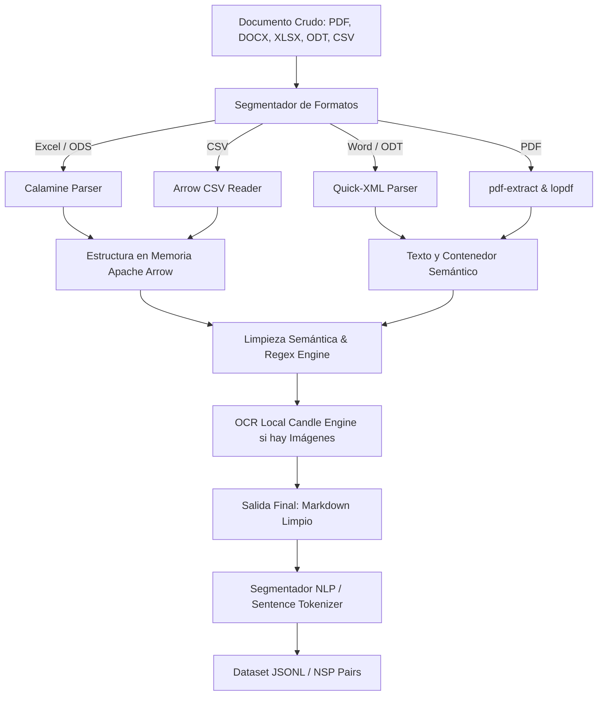

# Arquitectura del Motor `bgustdown`

Este documento describe detalladamente la visión técnica, el modelo conceptual y el flujo interno de datos de **bgustdown**.

---

## 🏛️ 1. Visión General del Sistema

`bgustdown` está diseñado como un motor de ingeniería de datos local-first y de alto rendimiento. Su objetivo principal es recibir documentos crudos heterogéneos y transformarlos en representaciones Markdown de alta fidelidad semántica o en datasets listos para el entrenamiento de modelos de procesamiento de lenguaje natural (NLP) e integraciones RAG (Retrieval-Augmented Generation).

### Flujo de Datos Conceptual

---

## 🏎️ 2. Componentes Clave

### A. Extracción en Memoria y Alto Rendimiento (Apache Arrow)
Para hojas de cálculo y datos tabulares estructurados (como archivos Excel y CSV), `bgustdown` evita el parseo secuencial ineficiente de strings. En su lugar:
* Mapea directamente los datos utilizando vectores de **Apache Arrow** (`arrow-array`, `arrow-schema`).
* Mantiene los datos en memoria con una disposición orientada a columnas de baja sobrecarga de serialización, facilitando la exportación inmediata hacia dataframes de Python o bases de datos de análisis a alta velocidad.

### B. Inferencia OCR Local (Candle Vision Engine)
Para páginas PDF escaneadas o imágenes incrustadas dentro de los documentos:
* `bgustdown` incorpora un motor de inferencia local e independiente basado en **Hugging Face Candle** (`candle-core`, `candle-transformers`).
* Se utiliza un modelo ligero de visión artificial/OCR que corre localmente en la CPU o acelerador de hardware (vía bindings nativos) sin necesidad de hacer llamadas API de red ni requerir instalaciones de Python en el entorno.

### C. Limpieza Semántica (`DatasetCleaner`)
Al convertir a Markdown, los extractores crudos suelen arrastrar ruido estructurado (encabezados repetitivos, pies de página, saltos de página huérfanos). El motor incluye un procesador determinista basado en autómatas de expresiones regulares optimizadas que:
* Detecta y remueve metadatos irrelevantes.
* Repara palabras cortadas por guiones al final de línea (`hyphenation repair`).
* Mantiene la jerarquía estructural (`#`, `##`, listas, tablas formateadas) para que sea óptima al indexarse en bases de datos vectoriales.
